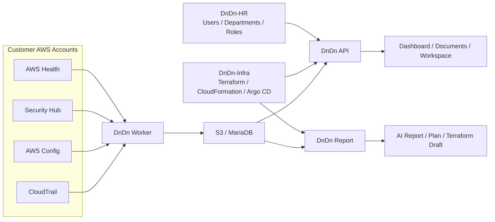
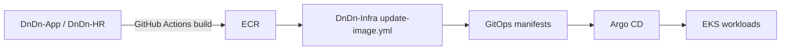

# 든든 (DnDn) ☁️

### AWS 운영 이벤트를 수집하고, 사람이 바로 판단할 수 있는 보고서와 실행 계획으로 연결하는 클라우드 운영 플랫폼

  <a href="https://github.com/ACS-DnDn/DnDn-App"><b>DnDn-App</b></a> ·
  <a href="https://github.com/ACS-DnDn/DnDn-Infra"><b>DnDn-Infra</b></a> ·
  <a href="https://github.com/ACS-DnDn/DnDn-HR"><b>DnDn-HR</b></a> ·
  <a href="https://github.com/ACS-DnDn/.github"><b>.github</b></a>

  
  
  
  
  
  

  
  
  

---

## ✨ What is DnDn?

든든은 여러 AWS 계정에서 발생하는 **변경 이력과 운영 이벤트**를 한곳으로 모아  
운영자가 바로 이해할 수 있는 **대시보드, 문서, 보고서, 실행 가능한 Terraform 초안**으로 연결하는 DevOps 플랫폼입니다.

우리가 집중하는 흐름은 단순합니다.

> **수집 → 정규화 → 저장 → 보고서/계획 생성 → 운영자 판단 → 후속 조치**

---

## 🧭 우리가 해결하려는 문제

클라우드 운영에서는 다음 질문에 답하는 데 시간이 많이 듭니다.

- 무엇이 바뀌었는가?
- 어떤 리소스에 영향이 있었는가?
- 지금 이 이벤트가 실제 조치가 필요한가?
- 다음 액션을 문서/계획/코드로 어떻게 이어갈 것인가?

DnDn은 이 과정을 더 짧고 명확하게 만들기 위해 설계되었습니다.

---

## 🏗️ Architecture at a glance

---

## 🧩 Repository map

| Repository | 역할 | 주요 기술 | 바로 보기 |
| --- | --- | --- | --- |
| [**DnDn-App**](https://github.com/ACS-DnDn/DnDn-App) | 메인 애플리케이션 모노레포. Web, API, Worker, Report, Contracts를 관리합니다. | React, TypeScript, FastAPI, Python, MariaDB | [README](https://github.com/ACS-DnDn/DnDn-App#readme) · [Worker](https://github.com/ACS-DnDn/DnDn-App/blob/main/apps/worker/README.md) · [Contracts](https://github.com/ACS-DnDn/DnDn-App/blob/main/contracts/README.md) |
| [**DnDn-Infra**](https://github.com/ACS-DnDn/DnDn-Infra) | AWS 인프라, 고객 계정 온보딩, Lambda, Argo CD 기반 GitOps, 운영 문서를 관리합니다. | Terraform, CloudFormation, AWS Lambda, Argo CD | [README](https://github.com/ACS-DnDn/DnDn-Infra#readme) · [Architecture](https://github.com/ACS-DnDn/DnDn-Infra/blob/main/docs/architecture.md) · [Runbook](https://github.com/ACS-DnDn/DnDn-Infra/blob/main/docs/operations-runbook.md) |
| [**DnDn-HR**](https://github.com/ACS-DnDn/DnDn-HR) | 사용자/부서/권한 운영을 위한 HR 포털 프론트엔드입니다. | React, TypeScript, Vite | [Repository](https://github.com/ACS-DnDn/DnDn-HR) |
| [**.github**](https://github.com/ACS-DnDn/.github) | 조직 프로필과 공통 GitHub 설정을 관리합니다. | Markdown, GitHub | [Profile README](https://github.com/ACS-DnDn/.github/blob/main/profile/README.md) |

---

## 🧱 Repo boundary

DnDn은 역할을 아래 기준으로 나눕니다.

| 관점 | 담당 |
| --- | --- |
| **What to run** | `DnDn-App`, `DnDn-HR` |
| **Where / How to run** | `DnDn-Infra` |
| **Data contract between services** | `DnDn-App/contracts` |

즉,  
- `DnDn-App`, `DnDn-HR`는 **제품 기능과 실행 산출물**을 만들고  
- `DnDn-Infra`는 그 산출물이 올라갈 **AWS / Kubernetes 런타임과 배포 경로**를 관리합니다.

---

## 🚀 Current implementation highlights

### 1) Event collection & normalization
- CloudTrail / AWS Config 기반 변경 이력 수집
- `WEEKLY`, `EVENT` 두 실행 모드 지원
- `SECURITYHUB`, `AWS_HEALTH`, `MANUAL` 이벤트 트리거 확장
- `canonical.json`, `event.json` 표준 결과물 생성
- `raw/index.json` 기반 evidence inventory 유지

### 2) Product workflow
- Dashboard / Documents / Workspace 중심 웹 화면 제공
- 메인 API에서 인증, 조직, 문서, 워크스페이스, GitHub/Slack 연동 제공
- Report 서비스에서 보고서, 계획서, Terraform 생성 / 검증 / 수정 흐름 제공
- SQS worker 기반 비동기 생성 작업 지원

### 3) Infra & delivery
- CloudFormation으로 고객 AWS 계정 온보딩
- Terraform으로 플랫폼 공통 인프라 관리
- Argo CD `app-of-apps` 기반 GitOps 운영
- 앱 레포 이미지 빌드 → ECR 푸시 → Git manifest 갱신 → Argo CD rollout

---

## 🔄 Delivery flow

---

## 🛠️ Tech stack

| Area | Stack |
| --- | --- |
| Frontend | React 19, TypeScript, Vite |
| Backend | FastAPI, SQLAlchemy, Python |
| Infra | AWS EventBridge, Lambda, S3, SQS, Cognito, EKS |
| IaC / Delivery | Terraform, CloudFormation, Argo CD, GitHub Actions |
| Data / AI | MariaDB, Amazon Bedrock, OPA |
| Integrations | GitHub, Slack, AWS STS |

---

## 📂 DnDn-App structure

<b>앱 모노레포 구성 보기</b>

| Path | 설명 |
| --- | --- |
| `apps/web` | 운영 대시보드, 문서 뷰어, 워크스페이스 UI |
| `apps/api` | 인증, 조직, 문서, 워크스페이스, 연동 API |
| `apps/worker` | AWS 이벤트 수집과 정규화 |
| `apps/report` | 보고서 / 계획서 / Terraform 생성 서비스 |
| `contracts` | Worker ↔ API ↔ Report 사이의 데이터 계약과 샘플 |
| `docs` | 운영 메모와 트러블슈팅 문서 |

---

## 📘 Read this first

- [DnDn-Infra / architecture.md](https://github.com/ACS-DnDn/DnDn-Infra/blob/main/docs/architecture.md)
- [DnDn-Infra / operations-runbook.md](https://github.com/ACS-DnDn/DnDn-Infra/blob/main/docs/operations-runbook.md)
- [DnDn-App / apps/worker/README.md](https://github.com/ACS-DnDn/DnDn-App/blob/main/apps/worker/README.md)
- [DnDn-App / contracts/README.md](https://github.com/ACS-DnDn/DnDn-App/blob/main/contracts/README.md)

---

## 👀 Explore order

1. **제품 흐름**이 궁금하면 → [`DnDn-App`](https://github.com/ACS-DnDn/DnDn-App)
2. **배포 / 인프라 / 운영 방식**이 궁금하면 → [`DnDn-Infra`](https://github.com/ACS-DnDn/DnDn-Infra)
3. **조직 / 부서 / 권한 화면**이 궁금하면 → [`DnDn-HR`](https://github.com/ACS-DnDn/DnDn-HR)

---

## 📌 Notes

- 현재 실운영 기준 환경 엔트리는 `terraform/envs/prod` 입니다.
- `dev` 환경은 scaffold/reference 구조가 준비되어 있지만, 즉시 적용 가능한 독립 환경으로 완전히 활성화된 상태는 아닙니다.
- 모니터링은 앱 배포 도메인과 분리되어 운영되며, 현재 GitOps 범위에는 앱 메트릭 연결을 위한 `ServiceMonitor` 리소스가 포함됩니다.

---

**ACS-DnDn은 클라우드 운영 자동화와 실무형 DevOps 경험을 연결하는 제품을 만들고 있습니다.** 🌱

